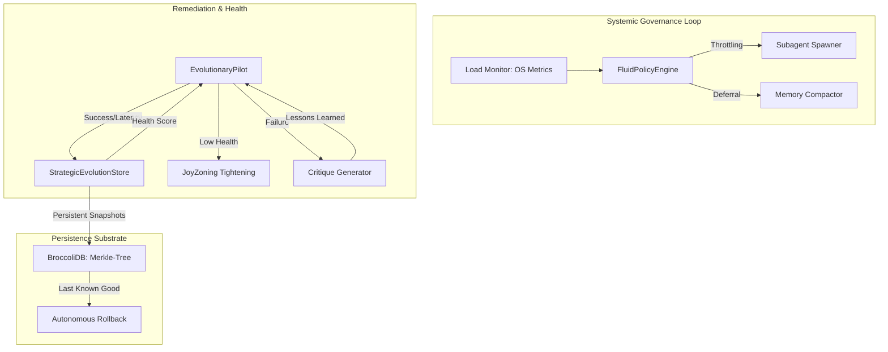

# Existential Autonomy Strategy

## Overview

**Existential Autonomy** is the architectural state where MarieCoder operates as a self-regulating, zero-touch engineering substrate. It moves beyond simple task execution into **Systemic Governance**, where the agent is responsible for its own resource management, error correction, and architectural integrity without human intervention.

## Architectural Architecture

## Core Mechanisms

### 1. Systemic Governance & Load Balancing

Marie does not blindly spawn subagents. The system monitors the host environment's physical health in real-time.

- **Load Monitor**: Integrates with `node:os` to track CPU load averages and memory pressure.
- **Throttling**: If systemic load exceeds 85%, the `FluidPolicyEngine` autonomously defers non-critical subagent spawning.
- **Maintenance Decoupling**: Background tasks like memory compaction are throttled or deferred during high-intensity remediation cycles.

### 2. Critique-Driven Remediation (Lessons Learned)

Instead of escalating to more expensive or higher-reasoning models upon failure, Marie implements a **Critique-Loop**.

- **Critique Snapshots**: When a remediation fails (e.g., build breakage), the system captures a "Critique" containing the failed diff, the error output, and an autonomous post-mortem.
- **Learning Injection**: These critiques are injected into the next remediation attempt as "Lessons Learned." This allows the system to converge on a solution by learning from its own entropy drift.

### 3. Systemic Health Steering

The system maintains a **Global Health Score** (0.0 - 1.0) derived from:

- **Success Rate**: Recent remediation/task completion ratio.
- **Latency Consistency**: Stability of tool execution times.

**Adaptive Guardrails**:

- **High Health**: Guardrails are permissive, allowing for rapid iteration.
- **Low Health**: The system autonomously tightens `JoyZoning` restrictions and triggers a "Sync & Audit" pass to reconcile the codebase before proceeding.

### 4. Autonomous Rollbacks & BroccoliDB Synergy

Stability is guaranteed by a "Last Known Good" (LKG) protocol, deeply integrated with the **BroccoliDB** Merkle-tree substrate.

- **Merkle Branching**: Remediation attempts are staged in isolated Merkle branches.
- **Persistent State**: All session data and file snapshots are stored in `StrategicEvolutionStore`.
- **Zero-Touch Reversion**: If a remediation fails to resolve a block-level violation or breaks the build, Marie autonomously performs an atomic rollback to the last stable Merkle root.

### 5. Systemic Architect Subagents

In scenarios involving architectural deadlocks or complex "Choke Points," the system spawns specialized **Architect Subagents**.

- **Scope**: These agents have full authority to refactor cross-module dependencies.
- **Trigger**: Spawned only when standard remediation fails to resolve drift after multiple critique-driven attempts.

## Case Studies

### A. The "Heavy-Load" Triage

During a massive documentation i18n run (high CPU/IO), a developer triggers a critical bugfix.

1. `Load Monitor` detects CPU usage > 90%.
2. `FluidPolicyEngine` blocks the formation of a secondary "Audit Swarm".
3. The fixed is prioritized as a "Critical Path" while the i18n compaction is deferred until load drops < 70%.

### B. The "Regression Loop"

A remediation attempt fix a lint error but inadvertently breaks a core test.

1. `EvolutionaryPilot` detects the build failure.
2. `StrategicEvolutionStore` triggers an autonomous rollback to the stable state.
3. A `Critique Snapshot` is generated, documenting why the specific fix was regressive.
4. The next attempt incorporates the critique, selecting an alternative refactoring strategy that preserved the test.

---

## Technical Implementation Reference

- `src/agents/strategic-evolution-store.ts`: Persistent metrics & Merkle state.
- `src/agents/evolutionary-pilot.ts`: Orchestrator for health steering.
- `src/agents/FluidPolicyEngine.ts`: Enforcement engine for governance.
- `src/agents/marie-memory-compactor.ts`: Autonomous context management.
